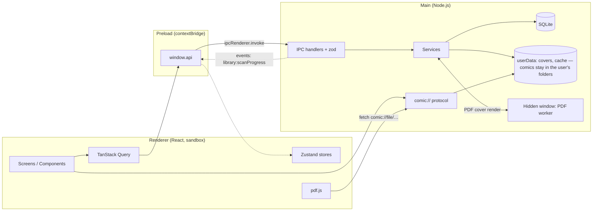

# 02 — Architecture

## 1. Stack

| Layer | Technology | Notes |
|---|---|---|
| Desktop shell | **Electron** (latest stable at setup time) | A single main `BrowserWindow` |
| Build | **electron-vite** + TypeScript `strict` | Separate builds for main, preload, and renderer |
| UI | **React** + **React Router** (`HashRouter`) | SPA inside the renderer |
| Styling | **Tailwind CSS v4** + **shadcn/ui** components (Radix) | Dark theme only |
| Icons | **lucide-react** | |
| UI state | **Zustand** | UI preferences, reader state, selection |
| Main data in the renderer | **TanStack Query** | Caching and invalidation of IPC calls |
| Large lists | **@tanstack/react-virtual** | Grids and vertical mode |
| i18n | **i18next** + **react-i18next** | Only `pt-BR` in v1 |
| Database | **SQLite** via **better-sqlite3** + **Drizzle ORM** | Versioned migrations, WAL |
| ZIP/CBZ | **yauzl** | Streaming reads with random access to entries |
| CBR | **node-unrar-js** | RAR via WASM, no native binary |
| PDF | **pdfjs-dist** (rendering) + **pdf-lib** (page count/size in the main process) | |
| Image dimensions | **image-size** | Reads only the header |
| Thumbnails | Electron's `nativeImage` | Resize + JPEG, no extra native dependency |
| Validation | **zod** | All IPC payloads |
| Logs | **electron-log** | File under `userData/logs` |
| Packaging | **electron-builder** (NSIS on Windows; dmg/zip on macOS; AppImage/deb on Linux) | `better-sqlite3` rebuilt per OS/arch via CI |
| Testing | **Vitest** + **Playwright** (`_electron`) | See [09](09-testes-e-qualidade.md) |

The rationale behind each choice is in [10-decisoes.md](10-decisoes.md).

## 2. Process overview



- **Main** is the only process with access to disk and the database. It contains all the business logic (services).
- **Preload** exposes a minimal, typed API (`window.api`) via `contextBridge`, without exposing raw `ipcRenderer`.
- **Renderer** is presentation only: it does not know file paths, only **IDs**.
- **Images** (pages and covers) never travel over IPC. The renderer uses `comic://` protocol URLs, served by the main process from disk.
- **PDF worker** is a hidden `BrowserWindow` (sandboxed, no UI) that the main process uses to render the first page of PDFs as JPEG during the scan (ADR-008 in [10-decisoes.md](10-decisoes.md)).
- The comics themselves **do not** live in `userData`: the app reads files directly from the root folders the user configures (`library_folders`, docs/03 §2.1; docs/05). `userData` only holds the database, generated covers, and disposable cache.

## 3. Main-process layers

```
ipc/            → boundary: validates input (zod), calls the service, wraps the Result
services/       → business logic; orchestrates repositories, files, cache
db/repositories → data access (Drizzle); no business logic
archive/        → format readers (zip, rar, pdf) behind a common interface
utils/          → paths, natural sort, hash, logger, queue
```

Rules:
- IPC handlers are thin: `parse → service.method() → ok(data)`. Exceptions become `AppError` (see [04](04-contratos-ipc.md#3-errors)).
- Services do not import `electron` directly, except for the adapters (`dialog`, `shell`, `nativeImage`, `BrowserWindow`), which are injected. This allows testing services with Vitest in plain Node.
- Multi-table operations are wrapped in `db.transaction(...)`.

### 3.1 Services

| Service | Responsibility | RFs |
|---|---|---|
| `LibraryScanService` | Recursively scans the root folders, detects format, dedups by hash, generates covers, indexes, cleans up missing files | RF-01..06 |
| `LibraryService` | Querying/listing with search, filters, and sorting, rename, favorite, status, deletion (with option to delete the file) | RF-10..19 |
| `ReaderService` | Opens a reading session, saves progress (with debounce and flush), per-comic preferences, completion, next file in folder | RF-30..44 |
| `PageCacheService` | Page extraction into the cache, size-based LRU, background pre-extraction | RF-43, RF-51 |
| `CoverService` | Comic thumbnail generation, PDF cover via worker | RF-06 |
| `SettingsService` | Reading/writing settings with defaults and validation | RF-50..53, RF-60, RF-61 |
| `MaintenanceService` | Boot routines: migrations, orphaned cover cleanup | RNF-05 |

### 3.2 Archive interface (`archive/`)

```ts
interface ComicArchive {
  /** Lists the image entries already in natural order, ignoring junk. */
  listPages(): Promise<ArchivePageEntry[]>;       // { index, entryName, size }
  /** Reads the binary content of a page. */
  readPage(entryName: string): Promise<Buffer>;
  /** Extracts all pages to a directory, in order, reporting progress. */
  extractAll(destDir: string, onPage: (i: number) => void, signal: AbortSignal): Promise<void>;
  close(): Promise<void>;
}
// Implementations: ZipArchive (yauzl), RarArchive (node-unrar-js).
// PDF does not implement ComicArchive: it is rendered by pdf.js in the renderer.
```

Format detection uses **magic bytes**, not just the extension: `PK\x03\x04` → ZIP, `Rar!\x1A\x07` → RAR, `%PDF` → PDF. A `.cbr` that is actually a ZIP (a common case) is treated as ZIP.

## 4. Project folder structure

```
comic-reader/
├─ electron.vite.config.ts
├─ electron-builder.yml
├─ drizzle.config.ts
├─ package.json
├─ tsconfig.json / tsconfig.node.json / tsconfig.web.json
├─ resources/                    # app icon (icon.ico, icon.png)
├─ src/
│  ├─ shared/                    # imported by main, preload, and renderer (no Node/DOM deps)
│  │  ├─ api.ts                  # ComicReaderApi interface (window.api contract)
│  │  ├─ channels.ts             # IPC channel names
│  │  ├─ schemas.ts              # zod schemas for inputs
│  │  ├─ types.ts                # DTOs: ComicSummary, LibraryFolder, ...
│  │  ├─ errors.ts               # AppErrorCode, Result<T>
│  │  └─ constants.ts            # limits, supported extensions, defaults
│  ├─ main/
│  │  ├─ index.ts                # bootstrap: single-instance, protocol, db, window, ipc
│  │  ├─ window.ts               # main window creation + bounds state
│  │  ├─ protocol.ts             # comic:// handler
│  │  ├─ pdf-worker-window.ts    # hidden PDF-rendering window
│  │  ├─ ipc/                    # one file per domain + register.ts
│  │  ├─ services/               # see 3.1
│  │  ├─ archive/                # zip.ts, rar.ts, detect.ts, index.ts
│  │  ├─ db/
│  │  │  ├─ client.ts            # opens SQLite, pragmas, runs migrations
│  │  │  ├─ schema.ts            # Drizzle tables
│  │  │  ├─ migrations/          # generated by drizzle-kit
│  │  │  └─ repositories/
│  │  └─ utils/                  # paths.ts, natural-sort.ts, hash.ts, normalize.ts, logger.ts
│  ├─ preload/
│  │  └─ index.ts                # contextBridge.exposeInMainWorld('api', ...)
│  ├─ pdf-worker/                # hidden window's renderer (index.html + main.ts with pdf.js)
│  └─ renderer/
│     ├─ index.html
│     └─ src/
│        ├─ main.tsx / App.tsx / routes.tsx
│        ├─ lib/api.ts           # wrapper that unwraps Result and throws a typed error
│        ├─ lib/query-keys.ts
│        ├─ i18n/ (index.ts, locales/pt-BR.json)
│        ├─ styles/globals.css   # Tailwind + tokens (@theme)
│        ├─ components/ui/       # generated shadcn components
│        ├─ components/          # AppShell, Sidebar, ComicCard, EmptyState, ...
│        ├─ features/
│        │  ├─ home/  library/  favorites/
│        │  ├─ reader/           # ReaderPage, modes, toolbar, keyboard hooks
│        │  ├─ library-folders/  # RefreshLibraryButton, LibraryFoldersSection
│        │  └─ settings/
│        └─ stores/              # ui-store.ts, reader-store.ts, selection-store.ts
├─ tests/
│  ├─ fixtures/                  # small CBZ/CBR/PDF/ZIP files (see 09)
│  ├─ unit/                      # optional; tests may also be co-located *.test.ts
│  └─ e2e/
└─ docs/
```

## 5. The `comic://` protocol

It is registered as a privileged scheme **before** `app.ready`:

```ts
protocol.registerSchemesAsPrivileged([
  { scheme: 'comic', privileges: { standard: true, secure: true, supportFetchAPI: true, stream: true } }
]);
```

And handled via `protocol.handle('comic', handler)`:

| URL | Returns | Use |
|---|---|---|
| `comic://page/{comicId}/{pageIndex}` | Page image (from cache; extracted on demand if missing) | `` in the reader (CBZ/CBR) |
| `comic://file/{comicId}` | Comic file bytes (supports `Range`) | pdf.js loads PDFs |
| `comic://cover/comic/{comicId}?v={coverVersion}` | Cover JPEG | Cards |
| `comic://cover/folder/{key}?v={mtime}` | JPEG of the cover chosen for a folder (`key` = validated sha1 hex) | Folder cards |

Handler rules:
- It only accepts IDs in the expected format (UUID) and an integer `pageIndex` within range. It **never** uses URL fragments as a path. The path is always resolved from the database record (`comics.file_path`) and from `paths.ts` (for cache/covers) — never from anything coming from the renderer.
- Sets `Content-Type` based on the image's real format and `Cache-Control: max-age=31536000, immutable` for versioned pages and covers (`?v=` changes when the cover changes).
- Returns 404 for nonexistent resources and 500 with a log on extraction failure. The renderer shows an error placeholder on the page.

## 6. Security

Mandatory checklist (RNF-06):

- [ ] `webPreferences`: `contextIsolation: true`, `sandbox: true`, `nodeIntegration: false`, `webSecurity: true`, `preload` pointing to the bundle.
- [ ] CSP in `index.html`: `default-src 'self'; img-src 'self' comic: data: blob:; connect-src 'self' comic:; script-src 'self'; style-src 'self' 'unsafe-inline'; font-src 'self'; worker-src 'self' blob:; object-src 'none'`.
- [ ] In dev, the CSP allows the Vite server (`ws://localhost:*`) only when `!app.isPackaged`.
- [ ] `setWindowOpenHandler` → `deny`. `will-navigate` blocked for any URL outside the app.
- [ ] The preload only exposes domain functions. No `ipcRenderer`, `require`, or `process` leaks.
- [ ] Every IPC handler validates input with zod, and invalid input produces the `VALIDATION` error.
- [ ] The only path coming from the system is the folder chosen in `libraryFolders.add()` (`dialog.showOpenDialog`, always in the main process). The renderer never sends file paths over IPC — only IDs.
- [ ] `app.requestSingleInstanceLock()`: a second instance only focuses the existing window.
- [ ] No network requests: fonts and icons are bundled.

## 7. Lifecycle

**Boot (`main/index.ts`)**
1. `requestSingleInstanceLock` (if it fails → `app.quit()`).
2. Register the `comic` scheme as privileged.
3. `app.whenReady()` →
   1. Ensure the `userData` directories exist ([03 §3](03-modelo-de-dados.md#3-disk-layout)).
   2. Open the database, apply pragmas, and run migrations.
   3. `MaintenanceService.run()`: remove orphaned covers in `covers/` (with no matching comic). Comics whose file disappeared are **not** removed here — that is the responsibility of the next scan (`LibraryScanService`, docs/05 §7).
   4. Register the IPC handlers and the `protocol.handle`.
   5. Create the window with the saved bounds and `show: false` → `ready-to-show` → `show()` (avoids the white flash; `backgroundColor` = theme background color).
4. `PageCacheService` applies the LRU limit in the background after boot, and `LibraryScanService.scan()` re-scans all root folders in the background (RF-04) — neither delays the window opening.

**Shutdown**
- `before-quit`: `ReaderService.flush()` writes pending progress (synchronously, better-sqlite3), saves the window bounds, and closes the database.
- `render-process-gone`: progress received up to that point is already in the main process (the renderer sends every page change), so `flush()` is called and the window is reloaded.

## 8. Data flow in the renderer

- **Reads** use `useQuery` with keys centralized in `src/renderer/src/lib/query-keys.ts` (e.g., `queryKeys.library.list(query)`, `queryKeys.libraryFolders.all()`).
- **Writes** use `useMutation`, with `invalidateQueries` on the affected keys. Favoriting and marking as read use optimistic updates.
- **Main-process events** (`library:scanProgress`, `library:changed`) update scan UI state and invalidate `queryKeys.library.all()`.
- **Zustand** only holds UI state, without duplicating database data.
