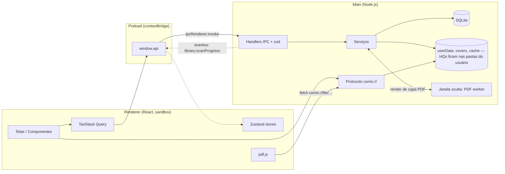

# 02 — Arquitetura

## 1. Stack

| Camada | Tecnologia | Observação |
|---|---|---|
| Shell desktop | **Electron** (última versão estável no setup) | Um único `BrowserWindow` principal |
| Build | **electron-vite** + TypeScript `strict` | Builds separados para main, preload e renderer |
| UI | **React** + **React Router** (`HashRouter`) | SPA dentro do renderer |
| Estilo | **Tailwind CSS v4** + componentes **shadcn/ui** (Radix) | Somente tema escuro |
| Ícones | **lucide-react** | |
| Estado de UI | **Zustand** | Preferências de UI, estado do leitor, seleção |
| Dados do main no renderer | **TanStack Query** | Cache e invalidação das chamadas IPC |
| Listas grandes | **@tanstack/react-virtual** | Grades e modo vertical |
| i18n | **i18next** + **react-i18next** | Só `pt-BR` na v1 |
| Banco | **SQLite** via **better-sqlite3** + **Drizzle ORM** | Migrations versionadas, WAL |
| ZIP/CBZ | **yauzl** | Leitura por streaming com acesso aleatório às entradas |
| CBR | **node-unrar-js** | RAR via WASM, sem binário nativo |
| PDF | **pdfjs-dist** (render) + **pdf-lib** (contagem/tamanho no main) | |
| Dimensões de imagem | **image-size** | Lê só o cabeçalho |
| Miniaturas | `nativeImage` do Electron | Resize + JPEG, sem dependência nativa extra |
| Validação | **zod** | Todos os payloads de IPC |
| Logs | **electron-log** | Arquivo em `userData/logs` |
| Empacotamento | **electron-builder** (NSIS no Windows; dmg/zip no macOS; AppImage/deb no Linux) | Rebuild do `better-sqlite3` por SO/arch via CI |
| Testes | **Vitest** + **Playwright** (`_electron`) | Ver [09](09-testes-e-qualidade.md) |

As justificativas de cada escolha estão em [10-decisoes.md](10-decisoes.md).

## 2. Visão geral dos processos



- **Main** é o único processo com acesso a disco e banco. Ele contém toda a regra de negócio (serviços).
- **Preload** expõe uma API mínima e tipada (`window.api`) via `contextBridge`, sem expor `ipcRenderer` cru.
- **Renderer** é só apresentação: não conhece caminhos de arquivo, só **IDs**.
- **Imagens** (páginas e capas) nunca trafegam por IPC. O renderer usa URLs do protocolo `comic://`, servidas pelo main a partir do disco.
- **PDF worker** é uma `BrowserWindow` oculta (sandbox, sem UI) que o main usa para renderizar a primeira página de PDFs em JPEG durante o scan (ADR-008 em [10-decisoes.md](10-decisoes.md)).
- As HQs em si **não** ficam em `userData`: o app lê os arquivos direto das pastas-raiz que o usuário configura (`library_folders`, docs/03 §2.1; docs/05). `userData` guarda só o banco, capas geradas e cache descartável.

## 3. Camadas do main

```
ipc/            → borda: valida input (zod), chama serviço, embrulha Result
services/       → regra de negócio; orquestra repositórios, arquivos, cache
db/repositories → acesso a dados (Drizzle); sem regra de negócio
archive/        → leitores de formato (zip, rar, pdf) atrás de uma interface comum
utils/          → paths, natural sort, hash, logger, fila
```

Regras:
- Os handlers IPC são finos: `parse → service.method() → ok(data)`. Exceções viram `AppError` (ver [04](04-contratos-ipc.md#3-erros)).
- Serviços não importam `electron` diretamente, exceto os adaptadores (`dialog`, `shell`, `nativeImage`, `BrowserWindow`), que são injetados. Isso permite testar os serviços com Vitest em Node puro.
- Operações multi-tabela ficam em `db.transaction(...)`.

### 3.1 Serviços

| Serviço | Responsabilidade | RFs |
|---|---|---|
| `LibraryScanService` | Escaneia recursivamente as pastas-raiz, detecta formato, dedup por hash, capa, indexa, limpa arquivos ausentes | RF-01..06 |
| `LibraryService` | Consulta/listagem com busca, filtros e ordenação, renomear, favoritar, status, exclusão (com opção de apagar o arquivo) | RF-10..19 |
| `ReaderService` | Abrir sessão de leitura, salvar progresso (com debounce e flush), preferências por HQ, conclusão, próximo arquivo da pasta | RF-30..44 |
| `PageCacheService` | Extração de páginas para o cache, LRU por tamanho, pré-extração em segundo plano | RF-43, RF-51 |
| `CoverService` | Geração de miniaturas de HQ, capa de PDF via worker | RF-06 |
| `SettingsService` | Leitura/escrita de configurações com defaults e validação | RF-50..53, RF-60, RF-61 |
| `MaintenanceService` | Rotinas de boot: migrations, limpeza de capas órfãs | RNF-05 |

### 3.2 Interface de arquivos (`archive/`)

```ts
interface ComicArchive {
  /** Lista as entradas de imagem já em ordem natural, ignorando lixo. */
  listPages(): Promise<ArchivePageEntry[]>;       // { index, entryName, size }
  /** Lê o conteúdo binário de uma página. */
  readPage(entryName: string): Promise<Buffer>;
  /** Extrai todas as páginas para um diretório, em ordem, reportando progresso. */
  extractAll(destDir: string, onPage: (i: number) => void, signal: AbortSignal): Promise<void>;
  close(): Promise<void>;
}
// Implementações: ZipArchive (yauzl), RarArchive (node-unrar-js).
// PDF não implementa ComicArchive: é renderizado pelo pdf.js no renderer.
```

A detecção de formato usa os **magic bytes**, não só a extensão: `PK\x03\x04` → ZIP, `Rar!\x1A\x07` → RAR, `%PDF` → PDF. Um `.cbr` que na verdade é ZIP (caso comum) é tratado como ZIP.

## 4. Estrutura de pastas do projeto

```
comic-reader/
├─ electron.vite.config.ts
├─ electron-builder.yml
├─ drizzle.config.ts
├─ package.json
├─ tsconfig.json / tsconfig.node.json / tsconfig.web.json
├─ resources/                    # ícone do app (icon.ico, icon.png)
├─ src/
│  ├─ shared/                    # importado por main, preload e renderer (sem deps de Node/DOM)
│  │  ├─ api.ts                  # interface ComicReaderApi (contrato do window.api)
│  │  ├─ channels.ts             # nomes dos canais IPC
│  │  ├─ schemas.ts              # schemas zod dos inputs
│  │  ├─ types.ts                # DTOs: ComicSummary, LibraryFolder, ...
│  │  ├─ errors.ts               # AppErrorCode, Result<T>
│  │  └─ constants.ts            # limites, extensões suportadas, defaults
│  ├─ main/
│  │  ├─ index.ts                # bootstrap: single-instance, protocol, db, janela, ipc
│  │  ├─ window.ts               # criação da janela principal + estado de bounds
│  │  ├─ protocol.ts             # handler de comic://
│  │  ├─ pdf-worker-window.ts    # janela oculta de render de PDF
│  │  ├─ ipc/                    # um arquivo por domínio + register.ts
│  │  ├─ services/               # ver 3.1
│  │  ├─ archive/                # zip.ts, rar.ts, detect.ts, index.ts
│  │  ├─ db/
│  │  │  ├─ client.ts            # abre o SQLite, pragmas, roda migrations
│  │  │  ├─ schema.ts            # tabelas Drizzle
│  │  │  ├─ migrations/          # geradas pelo drizzle-kit
│  │  │  └─ repositories/
│  │  └─ utils/                  # paths.ts, natural-sort.ts, hash.ts, normalize.ts, logger.ts
│  ├─ preload/
│  │  └─ index.ts                # contextBridge.exposeInMainWorld('api', ...)
│  ├─ pdf-worker/                # renderer da janela oculta (index.html + main.ts com pdf.js)
│  └─ renderer/
│     ├─ index.html
│     └─ src/
│        ├─ main.tsx / App.tsx / routes.tsx
│        ├─ lib/api.ts           # wrapper que desembrulha Result e lança erro tipado
│        ├─ lib/query-keys.ts
│        ├─ i18n/ (index.ts, locales/pt-BR.json)
│        ├─ styles/globals.css   # Tailwind + tokens (@theme)
│        ├─ components/ui/       # shadcn gerados
│        ├─ components/          # AppShell, Sidebar, ComicCard, EmptyState, ...
│        ├─ features/
│        │  ├─ home/  library/  favorites/
│        │  ├─ reader/           # ReaderPage, modos, toolbar, hooks de teclado
│        │  ├─ library-folders/  # RefreshLibraryButton, LibraryFoldersSection
│        │  └─ settings/
│        └─ stores/              # ui-store.ts, reader-store.ts, selection-store.ts
├─ tests/
│  ├─ fixtures/                  # CBZ/CBR/PDF/ZIP pequenos (ver 09)
│  ├─ unit/                      # opcional; testes podem ficar co-localizados *.test.ts
│  └─ e2e/
└─ docs/
```

## 5. Protocolo `comic://`

Ele é registrado como esquema privilegiado **antes** de `app.ready`:

```ts
protocol.registerSchemesAsPrivileged([
  { scheme: 'comic', privileges: { standard: true, secure: true, supportFetchAPI: true, stream: true } }
]);
```

E tratado com `protocol.handle('comic', handler)`:

| URL | Retorno | Uso |
|---|---|---|
| `comic://page/{comicId}/{pageIndex}` | Imagem da página (do cache; se ausente, extrai sob demanda) | `` no leitor (CBZ/CBR) |
| `comic://file/{comicId}` | Bytes do arquivo da HQ (suporta `Range`) | pdf.js carrega PDFs |
| `comic://cover/comic/{comicId}?v={coverVersion}` | JPEG da capa | Cards |
| `comic://cover/folder/{key}?v={mtime}` | JPEG da capa escolhida para uma pasta (`key` = sha1 hex validado) | Cards de pasta |

Regras do handler:
- Ele só aceita IDs no formato esperado (UUID) e `pageIndex` inteiro dentro do intervalo. **Nunca** usa trechos da URL como caminho. O caminho é sempre resolvido a partir do registro no banco (`comics.file_path`) e de `paths.ts` (para cache/capas) — nunca a partir de nada vindo do renderer.
- Define `Content-Type` pelo formato real da imagem e `Cache-Control: max-age=31536000, immutable` para páginas e capas versionadas (o `?v=` muda quando a capa muda).
- Responde 404 para inexistentes e 500 com log para falha de extração. O renderer mostra um placeholder de erro na página.

## 6. Segurança

Checklist obrigatório (RNF-06):

- [ ] `webPreferences`: `contextIsolation: true`, `sandbox: true`, `nodeIntegration: false`, `webSecurity: true`, `preload` apontando para o bundle.
- [ ] CSP no `index.html`: `default-src 'self'; img-src 'self' comic: data: blob:; connect-src 'self' comic:; script-src 'self'; style-src 'self' 'unsafe-inline'; font-src 'self'; worker-src 'self' blob:; object-src 'none'`.
- [ ] Em dev, a CSP permite o servidor Vite (`ws://localhost:*`) apenas quando `!app.isPackaged`.
- [ ] `setWindowOpenHandler` → `deny`. `will-navigate` bloqueado para qualquer URL fora do app.
- [ ] O preload expõe só funções de domínio. Nenhum `ipcRenderer`, `require` ou `process` vaza.
- [ ] Todo handler IPC valida o input com zod, e input inválido gera o erro `VALIDATION`.
- [ ] O único caminho vindo do sistema é a pasta escolhida em `libraryFolders.add()` (`dialog.showOpenDialog`, sempre no main). O renderer nunca envia caminhos de arquivo pelo IPC — só IDs.
- [ ] `app.requestSingleInstanceLock()`: uma segunda instância só foca a janela existente.
- [ ] Nenhuma requisição de rede: fontes e ícones empacotados.

## 7. Ciclo de vida

**Boot (`main/index.ts`)**
1. `requestSingleInstanceLock` (se falhar → `app.quit()`).
2. Registrar o esquema `comic` como privilegiado.
3. `app.whenReady()` →
   1. Garantir os diretórios de `userData` ([03 §3](03-modelo-de-dados.md#3-layout-em-disco)).
   2. Abrir o banco, aplicar pragmas e rodar migrations.
   3. `MaintenanceService.run()`: remover capas órfãs em `covers/` (sem HQ correspondente). As HQs cujo arquivo sumiu **não** são apagadas aqui — isso é responsabilidade do próximo scan (`LibraryScanService`, docs/05 §7).
   4. Registrar os handlers IPC e o `protocol.handle`.
   5. Criar a janela com os bounds salvos e `show: false` → `ready-to-show` → `show()` (evita o flash branco; `backgroundColor` = cor de fundo do tema).
4. `PageCacheService` aplica o limite de LRU em segundo plano após o boot, e `LibraryScanService.scan()` re-escaneia todas as pastas-raiz em segundo plano (RF-04) — nenhum dos dois atrasa a abertura da janela.

**Encerramento**
- `before-quit`: `ReaderService.flush()` grava o progresso pendente (síncrono, better-sqlite3), salva os bounds da janela e fecha o banco.
- `render-process-gone`: o progresso recebido até ali já está no main (o renderer envia cada mudança de página), então `flush()` é chamado e a janela é recarregada.

## 8. Fluxo de dados no renderer

- **Leituras** usam `useQuery` com chaves centralizadas em `src/renderer/src/lib/query-keys.ts` (ex.: `queryKeys.library.list(query)`, `queryKeys.libraryFolders.all()`).
- **Escritas** usam `useMutation`, com `invalidateQueries` nas chaves afetadas. Favoritar e marcar lida usam atualização otimista.
- **Eventos do main** (`library:scanProgress`, `library:changed`) atualizam o estado de scan em UI e invalidam `queryKeys.library.all()`.
- O **Zustand** guarda só o estado de UI, sem duplicar dados do banco.
