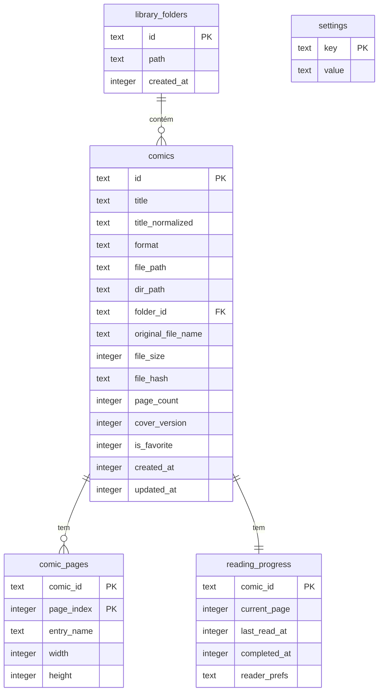

# 03 — Modelo de dados

## 1. Visão geral



Convenções:
- **IDs:** UUID v4 (`crypto.randomUUID()`), `TEXT`.
- **Datas:** epoch em milissegundos, `INTEGER`.
- **Booleanos:** `INTEGER` 0/1 (Drizzle `mode: 'boolean'`).
- **`*_normalized`:** minúsculas, sem acentos (`normalize('NFD').replace(/\p{Diacritic}/gu, '')`) e espaços colapsados. Usado em busca e unicidade.

## 2. Tabelas

### 2.1 `library_folders`

Pastas-raiz configuradas pelo usuário (RF-01/RF-03), escaneadas recursivamente pelo `LibraryScanService` (docs/05-importacao.md). O app nunca copia arquivos: as HQs são lidas in-place, a partir do caminho salvo em `comics.file_path` (ver ADR de `docs/10-decisoes.md`).

| Coluna | Tipo | Regras |
|---|---|---|
| `id` | TEXT PK | UUID |
| `path` | TEXT NOT NULL | Caminho absoluto, `UNIQUE` |
| `created_at` | INTEGER NOT NULL | |

Índice: `idx_folders_path(path)` (único).

Remover uma pasta-raiz apaga em cascata todas as HQs indexadas sob ela (`comics.folder_id` `ON DELETE CASCADE`) — nunca os arquivos originais.

### 2.2 `comics`

| Coluna | Tipo | Regras |
|---|---|---|
| `id` | TEXT PK | UUID |
| `title` | TEXT NOT NULL | 1–200 caracteres (RF-16) |
| `title_normalized` | TEXT NOT NULL | Atualizada junto com `title` |
| `format` | TEXT NOT NULL | `'zip' \| 'rar' \| 'pdf'`, formato **real** detectado por magic bytes |
| `file_path` | TEXT NOT NULL | Caminho absoluto do arquivo original, `UNIQUE`. **Nunca** exposto ao renderer — só IDs cruzam o IPC (docs/02 §4) |
| `dir_path` | TEXT NOT NULL | Pasta-pai de `file_path`; usado para achar o "próximo arquivo da pasta" (RF-42) |
| `folder_id` | TEXT NOT NULL FK → library_folders ON DELETE CASCADE | Pasta-raiz sob a qual o arquivo foi encontrado |
| `original_file_name` | TEXT NOT NULL | Nome original (para exibição em "Detalhes"/erros) |
| `file_size` | INTEGER NOT NULL | Bytes |
| `file_hash` | TEXT NOT NULL | SHA-1 hex do arquivo (RF-05), usado pra pular duplicatas entre pastas sobrepostas |
| `page_count` | INTEGER NOT NULL | ≥ 1 |
| `cover_version` | INTEGER NOT NULL DEFAULT 0 | Incrementado quando a capa é (re)gerada; 0 = capa ainda não gerada (placeholder) |
| `is_favorite` | INTEGER NOT NULL DEFAULT 0 | RF-15 |
| `created_at` | INTEGER NOT NULL | Data em que a HQ foi indexada |
| `updated_at` | INTEGER NOT NULL | |

Índices: `idx_comics_title_norm(title_normalized)`, `idx_comics_created(created_at)`, `idx_comics_hash(file_hash)`, `idx_comics_fav(is_favorite)`, `idx_comics_dir(dir_path)`, `idx_comics_file_path(file_path)` (único).

### 2.3 `comic_pages`

Ordem canônica das páginas de CBZ/CBR. Para PDF não há linhas (o pdf.js fornece as páginas), e `page_count` vem do `pdf-lib`.

| Coluna | Tipo | Regras |
|---|---|---|
| `comic_id` | TEXT FK → comics ON DELETE CASCADE | |
| `page_index` | INTEGER | 0-based, contínuo |
| `entry_name` | TEXT NOT NULL | Caminho da entrada dentro do arquivo compactado |
| `width` | INTEGER NULL | Preenchido na extração para o cache (via `image-size`) |
| `height` | INTEGER NULL | Idem |

PK: `(comic_id, page_index)`.
As dimensões servem para o modo página dupla (detectar páginas largas) e para os placeholders do modo vertical (evitar saltos de layout). Enquanto estão nulas, o renderer assume a proporção 2:3 e corrige ao carregar a imagem.

### 2.4 `reading_progress`

Uma linha por HQ, criada junto com a HQ.

| Coluna | Tipo | Regras |
|---|---|---|
| `comic_id` | TEXT PK FK → comics ON DELETE CASCADE | |
| `current_page` | INTEGER NOT NULL DEFAULT 0 | 0-based. Em página dupla, é a página da esquerda do spread |
| `last_read_at` | INTEGER NULL | Atualizado a cada salvamento de progresso |
| `completed_at` | INTEGER NULL | Não nulo = lida |
| `reader_prefs` | TEXT NULL | JSON `ReaderPrefs` (RF-41); nulo = usa os padrões globais |

**Status derivado** (RF-14), calculado em SQL:
```sql
CASE
  WHEN completed_at IS NOT NULL THEN 'read'
  WHEN current_page > 0          THEN 'reading'
  ELSE 'unread'
END
```
- Marcar **lida** manualmente (biblioteca): `completed_at = now` e `current_page = 0` (reabrir começa na 1ª página).
- Concluir a leitura no leitor (chegou ao fim): `completed_at = now`, `current_page` é mantido (o leitor abre na última).
- Marcar **não lida**: `completed_at = NULL, current_page = 0, last_read_at = NULL`.
- Salvar uma página **diferente** da `current_page` (voltar a ler uma HQ lida) zera `completed_at`: a HQ passa a "em andamento". Reabrir e salvar a mesma página não altera o status. Chegar de novo à última página marca como lida (RF-42).

`ReaderPrefs` (JSON, validado por zod):
```ts
type ReaderMode = 'single' | 'double' | 'vertical';
type FitMode = 'height' | 'width' | 'original';
interface ReaderPrefs {
  mode: ReaderMode;
  fit: FitMode;            // single/double
  zoom: number;            // 0.25–4.0, multiplicador sobre o fit (single/double)
  verticalWidth: number;   // 0.2–1.0, fração da área de leitura (vertical)
  doubleOffset: boolean;   // "Deslocar pares" (double)
}
```

Índices: `idx_progress_last_read(last_read_at)`, `idx_progress_completed(completed_at)`.

### 2.5 `settings`

Chave/valor com `value` em JSON. As chaves e os defaults ficam em `src/shared/constants.ts`:

| Chave | Tipo | Default | RF |
|---|---|---|---|
| `reader.defaults` | `ReaderPrefs` | `{mode:'single', fit:'height', zoom:1, verticalWidth:0.6, doubleOffset:false}` | RF-50 |
| `cache.maxBytes` | number | `2147483648` (2 GB) | RF-51 |
| `library.view` | `{sort, order, status, favoritesOnly}` | `{sort:'createdAt', order:'desc', status:'all', favoritesOnly:false}` | RF-13 |
| `ui.sidebarCollapsed` | boolean | `false` | RF-60 |
| `window.bounds` | `{x,y,width,height,maximized}` | 1280×800 centralizada | RF-61 |

## 3. Layout em disco

Raiz: `app.getPath('userData')` — Windows: `%APPDATA%\Comic Reader\`; macOS: `~/Library/Application Support/Comic Reader/`; Linux: `~/.config/Comic Reader/`. Todos os caminhos são construídos **só** em `src/main/utils/paths.ts`. Não existe mais uma pasta `library/`: as HQs continuam nas pastas do próprio usuário, referenciadas por `comics.file_path`.

```
userData/
├─ comic-reader.db            # SQLite (+ -wal, -shm)
├─ covers/
│  ├─ comics/{comicId}.jpg    # 400 px de largura, JPEG q=82
│  └─ folders/{key}.jpg       # capa escolhida pelo usuário p/ pasta sem HQs; key = sha1(folderId:relativePath)
├─ cache/
│  └─ pages/{comicId}/
│     ├─ 0000.jpg|png|webp|gif      # índice com 4+ dígitos, extensão original
│     └─ .complete                  # marcador: extração total concluída
└─ logs/
   └─ main.log
```

- O **cache** é descartável: apagar `cache/` nunca perde dados.
- As **capas** são dados derivados do app; podem ser regeneradas a partir das HQs.
- As HQs em si **não** vivem em `userData` — um backup do app (banco + capas) não substitui um backup das pastas do usuário.

## 4. Pragmas e migrations

```sql
PRAGMA journal_mode = WAL;
PRAGMA synchronous = NORMAL;
PRAGMA foreign_keys = ON;
PRAGMA busy_timeout = 5000;
```

- As migrations são geradas pelo `drizzle-kit generate` e aplicadas no boot com `migrate()` do Drizzle, lendo a pasta de migrations empacotada via `extraResources` do electron-builder.
- Nunca se edita uma migration já publicada. Toda mudança é uma nova migration. (Exceção pontual: a virada de `library`/coleções para pastas in-place, antes do lançamento da v1 e sem nenhum banco de usuário em produção, consolidou a baseline `0000` — ver ADR em `docs/10-decisoes.md`.)
- Os seeds de desenvolvimento (5.000 HQs falsas para RNF-02) ficam num script separado, `scripts/seed-dev.ts`, que nunca roda em produção.

## 5. Consultas principais (referência)

**Biblioteca com filtros (RF-10, RF-12, RF-13)**
```sql
SELECT c.*, p.current_page, p.last_read_at, p.completed_at, <status CASE> AS status
FROM comics c JOIN reading_progress p ON p.comic_id = c.id
WHERE (:q IS NULL OR c.title_normalized LIKE '%' || :q || '%')
  AND (:fav = 0 OR c.is_favorite = 1)
  AND (:status = 'all' OR <status CASE> = :status)
ORDER BY <c.title_normalized | c.created_at | p.last_read_at NULLS LAST> <ASC|DESC>, c.id
LIMIT :limit OFFSET :offset;
```

**Continuar lendo (RF-11)**
```sql
... WHERE p.completed_at IS NULL AND p.current_page > 0
ORDER BY p.last_read_at DESC LIMIT 20;
```

**Próximo arquivo da pasta (RF-42)**

SQLite não faz ordenação natural (`10` viria antes de `2`), então isto é resolvido em JS, não em SQL: busca todas as HQs da mesma `dir_path`, ordena com `naturalSort()` (`src/main/archive/natural-sort.ts`, já usado para ordenar páginas dentro de um arquivo) e pega a que vem depois de `file_path` na lista ordenada.
```sql
SELECT id, file_path FROM comics WHERE dir_path = :dirPath;
-- ordenação e "próximo" resolvidos em JS com naturalSort()
```

**Navegação por pastas (RF-64, docs/10 ADR-018)**

Não existe uma tabela de pastas intermediárias — só `library_folders` (pastas-raiz) e `comics.file_path`. `LibraryService.browseFolder` busca todas as HQs de uma pasta-raiz e agrupa em JS pelo primeiro segmento do caminho relativo ao nível pedido (`path.relative`): um segmento = HQ direta neste nível; mais de um = pertence à subpasta nomeada pelo primeiro segmento.
```sql
SELECT * FROM comics WHERE folder_id = :folderId;
-- agrupamento em subpastas x HQs diretas resolvido em JS (path.relative + split)
```
