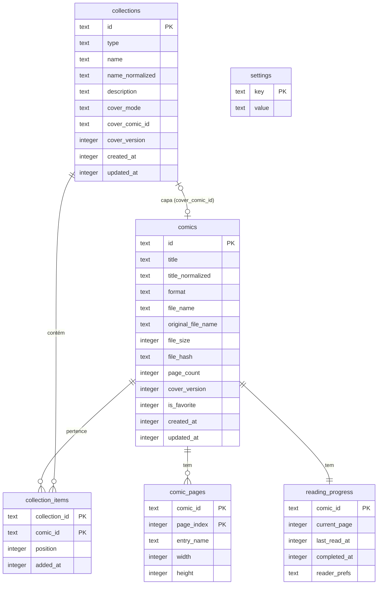

# 03 — Modelo de dados

## 1. Visão geral



Convenções:
- **IDs:** UUID v4 (`crypto.randomUUID()`), `TEXT`.
- **Datas:** epoch em milissegundos, `INTEGER`.
- **Booleanos:** `INTEGER` 0/1 (Drizzle `mode: 'boolean'`).
- **`*_normalized`:** minúsculas, sem acentos (`normalize('NFD').replace(/\p{Diacritic}/gu, '')`) e espaços colapsados. Usado em busca e unicidade.

## 2. Tabelas

### 2.1 `comics`

| Coluna | Tipo | Regras |
|---|---|---|
| `id` | TEXT PK | UUID |
| `title` | TEXT NOT NULL | 1–200 caracteres (RF-16) |
| `title_normalized` | TEXT NOT NULL | Atualizada junto com `title` |
| `format` | TEXT NOT NULL | `'zip' \| 'rar' \| 'pdf'`, formato **real** detectado por magic bytes |
| `file_name` | TEXT NOT NULL | Nome do arquivo dentro de `library/`: `{id}.{cbz\|cbr\|pdf}` |
| `original_file_name` | TEXT NOT NULL | Nome original (para exibição em "Detalhes"/erros) |
| `file_size` | INTEGER NOT NULL | Bytes |
| `file_hash` | TEXT NOT NULL | SHA-1 hex do arquivo (RF-05). **Não** é único, porque "Importar mesmo assim" permite duplicar |
| `page_count` | INTEGER NOT NULL | ≥ 1 |
| `cover_version` | INTEGER NOT NULL DEFAULT 0 | Incrementado quando a capa é (re)gerada; 0 = capa ainda não gerada (placeholder) |
| `is_favorite` | INTEGER NOT NULL DEFAULT 0 | RF-15 |
| `created_at` | INTEGER NOT NULL | Data da importação |
| `updated_at` | INTEGER NOT NULL | |

Índices: `idx_comics_title_norm(title_normalized)`, `idx_comics_created(created_at)`, `idx_comics_hash(file_hash)`, `idx_comics_fav(is_favorite)`.

### 2.2 `comic_pages`

Ordem canônica das páginas de CBZ/CBR. Para PDF não há linhas (o pdf.js fornece as páginas), e `page_count` vem do `pdf-lib`.

| Coluna | Tipo | Regras |
|---|---|---|
| `comic_id` | TEXT FK → comics ON DELETE CASCADE | |
| `page_index` | INTEGER | 0-based, contínuo |
| `entry_name` | TEXT NOT NULL | Caminho da entrada dentro do arquivo compactado |
| `width` | INTEGER NULL | Preenchido na extração para o cache (via `image-size`) |
| `height` | INTEGER NULL | Idem |

PK: `(comic_id, page_index)`.
As dimensões servem para o modo página dupla (detectar páginas largas) e para os placeholders do modo vertical (evitar saltos de layout). Enquanto estão nulas, o renderer assume a proporção 2:3 e corrige ao carregar a imagem.

### 2.3 `reading_progress`

Uma linha por HQ, criada junto com a HQ.

| Coluna | Tipo | Regras |
|---|---|---|
| `comic_id` | TEXT PK FK → comics ON DELETE CASCADE | |
| `current_page` | INTEGER NOT NULL DEFAULT 0 | 0-based. Em página dupla, é a página da esquerda do spread |
| `last_read_at` | INTEGER NULL | Atualizado a cada salvamento de progresso |
| `completed_at` | INTEGER NULL | Não nulo = lida |
| `reader_prefs` | TEXT NULL | JSON `ReaderPrefs` (RF-41); nulo = usa os padrões globais |

**Status derivado** (RF-14), calculado em SQL:
```sql
CASE
  WHEN completed_at IS NOT NULL THEN 'read'
  WHEN current_page > 0          THEN 'reading'
  ELSE 'unread'
END
```
- Marcar **lida**: `completed_at = now`. `current_page` é mantido (reabrir continua de onde estava; se estava na última página, o leitor abre na última).
- Marcar **não lida**: `completed_at = NULL, current_page = 0, last_read_at = NULL`.
- Reabrir uma HQ lida e navegar **não** remove o `completed_at`.

`ReaderPrefs` (JSON, validado por zod):
```ts
type ReaderMode = 'single' | 'double' | 'vertical';
type FitMode = 'height' | 'width' | 'original';
interface ReaderPrefs {
  mode: ReaderMode;
  fit: FitMode;            // single/double
  zoom: number;            // 0.25–4.0, multiplicador sobre o fit (single/double)
  verticalWidth: number;   // 0.2–1.0, fração da área de leitura (vertical)
  doubleOffset: boolean;   // "Deslocar pares" (double)
}
```

Índices: `idx_progress_last_read(last_read_at)`, `idx_progress_completed(completed_at)`.

### 2.4 `collections`

| Coluna | Tipo | Regras |
|---|---|---|
| `id` | TEXT PK | UUID |
| `type` | TEXT NOT NULL | `'list' \| 'saga'` |
| `name` | TEXT NOT NULL | 1–100 caracteres |
| `name_normalized` | TEXT NOT NULL | `UNIQUE(type, name_normalized)` (RF-20) |
| `description` | TEXT NULL | Até 500 caracteres |
| `cover_mode` | TEXT NOT NULL DEFAULT `'auto'` | `'auto' \| 'image' \| 'comic'` (RF-25) |
| `cover_comic_id` | TEXT NULL FK → comics ON DELETE SET NULL | Usado quando `cover_mode='comic'` |
| `cover_version` | INTEGER NOT NULL DEFAULT 0 | Incrementado ao trocar a imagem própria |
| `created_at` / `updated_at` | INTEGER NOT NULL | `updated_at` também muda quando itens entram, saem ou são reordenados |

**Resolução da capa** (feita no `CollectionService`, que devolve `coverUrl` pronta):
1. `image` → `comic://cover/collection/{id}?v={cover_version}`
2. `comic` e `cover_comic_id` ainda na coleção → capa dessa HQ
3. caso contrário (`auto`, ou fallback) → capa da HQ de menor `position`; coleção vazia → `null` (placeholder)

Quando uma HQ usada em `cover_mode='comic'` sai da coleção ou é excluída, o serviço redefine `cover_mode='auto'` na mesma transação (RF-25).

### 2.5 `collection_items`

| Coluna | Tipo | Regras |
|---|---|---|
| `collection_id` | TEXT FK → collections ON DELETE CASCADE | |
| `comic_id` | TEXT FK → comics ON DELETE CASCADE | |
| `position` | INTEGER NOT NULL | 0-based, contínuo dentro da coleção |
| `added_at` | INTEGER NOT NULL | |

PK: `(collection_id, comic_id)` (RF-23: sem repetição). Índices: `idx_items_order(collection_id, position)` e `idx_items_comic(comic_id)`.

- Inserir usa `position = MAX(position)+1`.
- Remover ou reordenar **renormaliza** as posições (0..n-1) na mesma transação. As coleções são pequenas (dezenas a centenas), então o custo é desprezível.
- Para listas, `position` também é mantido e reflete a ordem de adição, o que permite converter a lista em saga sem perda (RF-21).

### 2.6 `settings`

Chave/valor com `value` em JSON. As chaves e os defaults ficam em `src/shared/constants.ts`:

| Chave | Tipo | Default | RF |
|---|---|---|---|
| `reader.defaults` | `ReaderPrefs` | `{mode:'single', fit:'height', zoom:1, verticalWidth:0.6, doubleOffset:false}` | RF-50 |
| `reader.focusMode` | boolean | `false` | RF-38 |
| `cache.maxBytes` | number | `2147483648` (2 GB) | RF-51 |
| `library.view` | `{sort, order, status, favoritesOnly}` | `{sort:'createdAt', order:'desc', status:'all', favoritesOnly:false}` | RF-13 |
| `ui.sidebarCollapsed` | boolean | `false` | RF-60 |
| `window.bounds` | `{x,y,width,height,maximized}` | 1280×800 centralizada | RF-61 |
| `import.duplicatePolicy` | `'ask'` | `'ask'` | RF-05 (reservado para v2) |

## 3. Layout em disco

Raiz: `app.getPath('userData')` (Windows: `%APPDATA%\Comic Reader\`). Todos os caminhos são construídos **só** em `src/main/utils/paths.ts`.

```
userData/
├─ comic-reader.db            # SQLite (+ -wal, -shm)
├─ library/
│  └─ {comicId}.cbz|cbr|pdf   # cópia do arquivo importado (extensão = formato real)
├─ covers/
│  ├─ comics/{comicId}.jpg          # 400 px de largura, JPEG q=82
│  └─ collections/{collectionId}.jpg# imagem própria, 600 px de largura, JPEG q=85
├─ cache/
│  ├─ pages/{comicId}/
│  │  ├─ 0000.jpg|png|webp|gif      # índice com 4+ dígitos, extensão original
│  │  └─ .complete                  # marcador: extração total concluída
│  └─ tmp/                          # área de trabalho da importação (limpa no boot)
└─ logs/
   └─ main.log
```

- O **cache** é descartável: apagar `cache/` nunca perde dados.
- A **biblioteca** e as **capas** são dados do usuário. Capas podem ser regeneradas a partir da biblioteca.
- Um backup consiste em copiar `comic-reader.db`, `library/` e `covers/`.

## 4. Pragmas e migrations

```sql
PRAGMA journal_mode = WAL;
PRAGMA synchronous = NORMAL;
PRAGMA foreign_keys = ON;
PRAGMA busy_timeout = 5000;
```

- As migrations são geradas pelo `drizzle-kit generate` e aplicadas no boot com `migrate()` do Drizzle, lendo a pasta de migrations empacotada via `extraResources` do electron-builder.
- Nunca se edita uma migration já publicada. Toda mudança é uma nova migration.
- Os seeds de desenvolvimento (5.000 HQs falsas para RNF-02) ficam num script separado, `scripts/seed-dev.ts`, que nunca roda em produção.

## 5. Consultas principais (referência)

**Biblioteca com filtros (RF-10, RF-12, RF-13)**
```sql
SELECT c.*, p.current_page, p.last_read_at, p.completed_at, <status CASE> AS status
FROM comics c JOIN reading_progress p ON p.comic_id = c.id
WHERE (:q IS NULL OR c.title_normalized LIKE '%' || :q || '%')
  AND (:fav = 0 OR c.is_favorite = 1)
  AND (:status = 'all' OR <status CASE> = :status)
ORDER BY <c.title_normalized | c.created_at | p.last_read_at NULLS LAST> <ASC|DESC>, c.id
LIMIT :limit OFFSET :offset;
```

**Continuar lendo (RF-11)**
```sql
... WHERE p.completed_at IS NULL AND p.current_page > 0
ORDER BY p.last_read_at DESC LIMIT 20;
```

**Progresso da saga (RF-24)**
```sql
SELECT COUNT(*) AS total, SUM(p.completed_at IS NOT NULL) AS read
FROM collection_items i JOIN reading_progress p ON p.comic_id = i.comic_id
WHERE i.collection_id = :id;
```

**Próxima da saga (RF-42)**
```sql
SELECT i2.comic_id FROM collection_items i1
JOIN collection_items i2 ON i2.collection_id = i1.collection_id AND i2.position = i1.position + 1
WHERE i1.collection_id = :sagaId AND i1.comic_id = :comicId;
```
