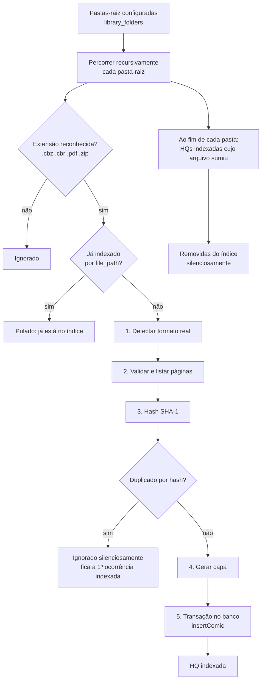

# 05 — Biblioteca em pastas (scan)

Cobre RF-01 a RF-06 e RNF-05.

> **Nota (docs/10-decisoes.md):** este documento descrevia originalmente um pipeline de *importação* — o usuário escolhia arquivos um a um (ou soltava-os na janela) e o app **copiava** cada um para uma pasta interna gerenciada (`library/`). Esse modelo foi substituído: o usuário aponta para uma ou mais pastas onde já organiza suas HQs, e o app as escaneia recursivamente e as lê **in-place**, sem copiar nada. Ver ADR correspondente em `docs/10-decisoes.md`.

## 1. Visão geral

O scan é feito pelo `LibraryScanService` (`src/main/services/library-scan-service.ts`), disparado (a) automaticamente no boot do app, e (b) sob demanda pelo botão "Atualizar biblioteca" da sidebar ou ao adicionar uma pasta nova. Não há file-watcher em tempo real (v2) — o scan é sempre um evento pontual, do início ao fim.

## 2. Percorrendo as pastas-raiz (RF-02, RF-03)

`walkDirectory()` (`src/main/utils/walk-directory.ts`) é um gerador assíncrono recursivo:

1. Lista o conteúdo da pasta com `readdir(..., { withFileTypes: true })`.
2. Ignora dotfiles/dot-pastas e nomes conhecidos de lixo (`.git`, `__MACOSX`, `node_modules`).
3. Não segue links simbólicos para subpastas (evita ciclos).
4. Para cada arquivo, filtra pela extensão (minúscula): `.cbz`, `.cbr`, `.pdf`, `.zip` (`IMPORTABLE_EXTENSIONS`, `src/shared/constants.ts`). Qualquer outra extensão é ignorada silenciosamente — não há "resumo de erros" como no antigo pipeline, porque o scan roda sozinho, sem um usuário esperando um diálogo.
5. "Pode estar em cadeia" (RF-02): a recursão não tem limite de profundidade — subpastas dentro de subpastas são todas percorridas.

Cada pasta-raiz é uma linha de `library_folders` (docs/03 §2.1); o `LibraryScanService.scan()` itera todas elas.

## 3. HQ dentro de um `.zip` (RF-02)

Diferente do antigo pipeline (que também inspecionava ZIPs em busca de HQs *internas*, ex.: um `pack.zip` contendo vários `.cbz`), o scan de pastas trata cada `.zip` encontrado como **uma única HQ candidata** — igual a um `.cbz`. Se o ZIP contém só imagens, vira uma HQ com essas imagens como páginas (mesma lógica de validação do passo 2 abaixo). Um `.zip` que na prática é um "pacote" de várias HQs deve ser desempacotado pelo próprio usuário na pasta (é organização de arquivos, fora do escopo do app — ver `docs/10-decisoes.md`).

## 4. Processando um arquivo encontrado (`LibraryScanService.importFile`)

| # | Passo | Detalhes | Resultado se falhar |
|---|---|---|---|
| 1 | **Detectar formato** | Lê os bytes do arquivo (in-place, sem copiar) e a assinatura: `PK\x03\x04` → zip, `Rar!\x1A\x07` → rar, `%PDF-` → pdf. A extensão errada é tolerada (ex.: `.cbr` que é ZIP). | Assinatura desconhecida → arquivo ignorado, aviso no log |
| 2 | **Validar e listar páginas** | zip/rar: `listPages()` → filtra imagens (§5) e ordena com natural sort. Exige ≥ 1 página. pdf: `pdf-lib` → `getPageCount()` ≥ 1. | Sem páginas/corrompido → ignorado, aviso no log |
| 3 | **Hash** | SHA-1 do conteúdo do arquivo. | — |
| 4 | **Duplicata** | `SELECT id, title FROM comics WHERE file_hash = ?` (mesma HQ alcançável por duas pastas-raiz sobrepostas, ou um arquivo duplicado de fato). Se já existe, o arquivo é ignorado — sem diálogo: o scan é automático e não interativo (RF-05). | Ignorado, aviso no log |
| 5 | **Capa** | zip/rar: lê a página 0 → `resizeToJpeg` → 400 px de largura, JPEG q82 → `covers/comics/{id}.jpg`. pdf: placeholder (`cover_version = 0`) até o suporte a render de PDF chegar (ver TODO em `cover-service.ts`). Uma falha na capa **nunca** impede a indexação. | — (só log) |
| 6 | **Banco** | Em uma transação (`insertComic`): `INSERT comics` (com `file_path`, `dir_path`, `folder_id`), `INSERT comic_pages` (zip/rar), `INSERT reading_progress`. | Arquivo ignorado, erro logado |

Como não há mais "materializar em tmp" nem "mover para `library/`" (a HQ é lida direto do caminho onde está), o pipeline ficou mais curto — e mais robusto: cada arquivo processado só toca o banco na etapa final, numa única transação atômica, então uma queda do app no meio do scan nunca deixa um registro parcial (só HQs ainda não escaneadas, que o próximo scan retoma).

## 5. Regras de páginas

Inalteradas em relação ao pipeline anterior:

- **Extensões de imagem aceitas:** `.jpg .jpeg .png .webp .gif .bmp .avif` (sem diferenciar maiúsculas).
- **Ignorar:** entradas de diretório, `__MACOSX/`, arquivos começando com `.` (ex.: `._001.jpg`), `Thumbs.db`, `desktop.ini`, `ComicInfo.xml` (reservado para v2), `.txt`, `.nfo`, `.xml`, `.url`.
- **Ordem:** natural sort sobre o **caminho completo** da entrada (`Intl.Collator('en', { numeric: true, sensitivity: 'base' })`, `src/main/archive/natural-sort.ts`), para que `pasta1/10.jpg` fique depois de `pasta1/2.jpg` e as subpastas sejam respeitadas.
- `page_index` é 0-based e contínuo após o filtro.

## 6. "Próximo arquivo da pasta" (RF-42)

O mesmo utilitário de ordenação natural (`naturalSort()`) resolve a navegação "próxima HQ" no fim da leitura: ao abrir uma HQ, o `ReaderService` busca todas as HQs com o mesmo `dir_path` (docs/03 §2.2), ordena os `file_path` com `naturalSort()` e devolve a que vem logo depois da atual (`null` se for a última ou a única do diretório). Isso substitui inteiramente a antiga navegação por "próxima da saga" — não depende de nenhuma organização manual, só da ordem alfanumérica dos nomes de arquivo dentro da pasta.

## 7. Arquivos que somem (RF-04)

Ao final de cada pasta-raiz, o scan compara as HQs já indexadas sob ela (`listComicsInFolder`) contra o disco (`existsSync`). As que não existem mais são removidas do índice pela mesma rotina de exclusão do `LibraryService` (`delete(ids, { deleteFile: false })`), que também limpa capa e cache — nunca tenta apagar um arquivo que já não existe. Isso cobre tanto arquivos apagados de fato quanto movidos/renomeados fora do app: um novo scan reencontra o arquivo no caminho novo como uma HQ "nova" (novo id, progresso zerado — não há como saber que é "a mesma" HQ sem olhar o conteúdo, e o hash sozinho não basta para decidir isso automaticamente sem arriscar reaproveitar progresso da HQ errada).

## 8. Adicionar/remover pastas-raiz (RF-01, RF-03)

- **Adicionar:** `libraryFolders.add()` abre `dialog.showOpenDialog({ properties: ['openDirectory'] })`. Ao confirmar, a pasta é salva (`insertLibraryFolder`) e um scan roda antes do IPC resolver, para a UI já poder listar as HQs novas.
- **Remover:** `libraryFolders.remove(id)` apaga a linha de `library_folders`; a cascata do banco remove as HQs indexadas sob ela (nunca os arquivos, docs/03 §2.1).
- Pasta já configurada (mesmo caminho) → `CONFLICT`.

## 9. Limites e desempenho

- Sem limite de tamanho de arquivo. A exceção é o `node-unrar-js`, que precisa do arquivo em memória para RAR: arquivos RAR muito grandes geram maior uso de memória durante o scan — aceitável porque o scan roda em segundo plano, um arquivo por vez.
- Escanear 5.000 arquivos não deve travar a UI: o `LibraryScanService` roda inteiramente no main, e cada arquivo é uma operação assíncrona isolada (RNF-02).

## 10. Casos de teste obrigatórios

Ver fixtures em [09](09-testes-e-qualidade.md#3-fixtures).

1. CBZ válido numa pasta-raiz → 1 HQ, páginas em ordem natural, capa gerada.
2. CBR válido (RAR4 e RAR5) → 1 HQ.
3. `.cbr` que na verdade é ZIP → importado como zip.
4. PDF válido → 1 HQ com `page_count` correto.
5. ZIP só com imagens → 1 HQ.
6. Subpasta dentro de subpasta (2+ níveis) → arquivos encontrados e indexados.
7. Arquivo corrompido/truncado → ignorado, sem interromper o scan das demais.
8. Mesmo arquivo alcançável por duas pastas-raiz (ou hash duplicado) → só a primeira ocorrência é indexada.
9. Arquivo removido/renomeado externamente → some do índice no próximo scan.
10. Extensão `.epub` → ignorada.
11. Scan interrompido no meio (kill do processo) → ao reabrir, o próximo scan automático completa o trabalho sem duplicar HQs já indexadas.
