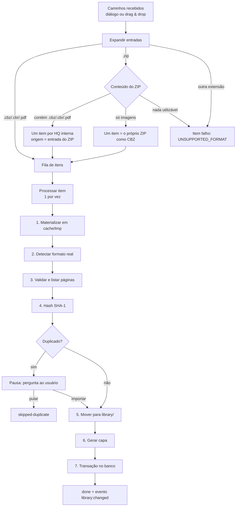

# 05 — Pipeline de importação

Cobre RF-01 a RF-06 e RNF-05.

## 1. Visão geral

## 2. Expansão das entradas

Entrada: `string[]` de caminhos absolutos.

1. Descartar os caminhos inexistentes ou que não sejam arquivos (item `failed`, `IO`).
2. Classificar pela extensão (minúscula):
   - `.cbz`, `.cbr`, `.pdf` → **item simples**.
   - `.zip` → **inspecionar** (seção 3).
   - Qualquer outra → item `failed` com `UNSUPPORTED_FORMAT` (aparece no resumo, RF-02).
3. Ordenar os itens resultantes por natural sort do nome, para que as HQs de um pacote entrem em ordem ("Batman 01", "Batman 02", …, "Batman 10").

## 3. Inspeção de ZIP (RF-03)

Lista as entradas do ZIP (só o diretório central, sem descompactar):

| Conteúdo (ignorando lixo, ver §5) | Resultado |
|---|---|
| ≥ 1 entrada `.cbz`/`.cbr`/`.pdf` (em qualquer subpasta) | Um item para **cada** HQ interna, com `source = { zip, entryName }`. Imagens soltas são ignoradas com aviso "N imagens soltas ignoradas em pack.zip". |
| Nenhuma HQ interna, ≥ 1 imagem | Um item: o ZIP inteiro tratado como CBZ. |
| Entradas `.zip` internas | Não expandidas (1 nível só). Item `failed` com `UNSUPPORTED_FORMAT` e nome "pack.zip › inner.zip". |
| Vazio / sem nada utilizável | Item `failed` com `CORRUPTED_FILE`. |

O título de uma HQ interna vem do nome da entrada (sem pastas e sem extensão). O `sourceName` exibido é `pack.zip › Batman 01.cbz`.

## 4. Processamento de um item

Os itens são processados **sequencialmente**: é I/O pesado e evita disputa de disco. Cada item tem um `AbortController`, e o cancelamento aborta o passo atual.

| # | Passo | Detalhes | Erros |
|---|---|---|---|
| 1 | **Materializar** | Item simples: copia o arquivo para `cache/tmp/{itemId}.part` em stream. Item de ZIP: extrai a entrada interna para o mesmo destino. | `IO` (sem espaço, permissão, arquivo em uso) |
| 2 | **Detectar formato** | Lê os 8 primeiros bytes: `PK\x03\x04` → zip, `Rar!\x1A\x07` → rar, `%PDF-` → pdf. A extensão errada é tolerada (ex.: `.cbr` que é ZIP). | Assinatura desconhecida → `UNSUPPORTED_FORMAT` |
| 3 | **Validar e listar páginas** | zip/rar: `listPages()` → filtra imagens (§5) e ordena com natural sort. Exige ≥ 1 página. RAR com senha → erro. pdf: `pdf-lib` → `getPageCount()` ≥ 1 (PDF criptografado → erro). | `CORRUPTED_FILE` |
| 4 | **Hash** | SHA-1 em stream do arquivo materializado. | `IO` |
| 5 | **Duplicata** | `SELECT id, title FROM comics WHERE file_hash = ?`. Se existe e não há decisão "aplicar a todos", o item vai para `awaiting-duplicate-decision` e o job para `paused-for-decision`; o processamento aguarda `resolveDuplicate`. | — |
| 6 | **Mover para a biblioteca** | Gera `comicId`, faz `rename` de `tmp/{itemId}.part` → `library/{comicId}.{cbz\|cbr\|pdf}` (mesmo volume, atômico). | `IO` |
| 7 | **Capa** | zip/rar: lê a página 0 → `nativeImage.createFromBuffer` → resize para 400 px de largura → JPEG q82 → `covers/comics/{id}.jpg`. pdf: pede ao PDF worker (render da página 1 em 400 px). Se a capa falhar, **não** falha o item (`cover_version = 0`, placeholder) e o erro é logado. | — (só log) |
| 8 | **Banco** | Em uma transação: `INSERT comics`, `INSERT comic_pages` (zip/rar), `INSERT reading_progress`. | `INTERNAL` |

**Rollback:** se o passo N falhar ou o item for cancelado, desfaz o que foi feito: apaga o `.part`, o arquivo em `library/` e a capa. A transação do banco é atômica. O item fica `failed` ou `cancelled` e a fila segue para o próximo.

**Após cada item concluído:** emite `library:changed` (com throttle de 500 ms durante a fila), para que a biblioteca vá mostrando as HQs à medida que entram.

## 5. Regras de páginas

- **Extensões de imagem aceitas:** `.jpg .jpeg .png .webp .gif .bmp .avif` (sem diferenciar maiúsculas).
- **Ignorar:** entradas de diretório, `__MACOSX/`, arquivos começando com `.` (ex.: `._001.jpg`), `Thumbs.db`, `desktop.ini`, `ComicInfo.xml` (reservado para v2), `.txt`, `.nfo`, `.xml`, `.url`.
- **Ordem:** natural sort sobre o **caminho completo** da entrada (`Intl.Collator('en', { numeric: true, sensitivity: 'base' })`), para que `pasta1/10.jpg` fique depois de `pasta1/2.jpg` e as subpastas sejam respeitadas.
- `page_index` é 0-based e contínuo após o filtro.

## 6. Fila, eventos e UI

- Existe uma única fila global (`ImportService`). Chamar `start()` durante uma execução adiciona itens ao job corrente.
- O job termina quando todos os itens estão em um estado final. Então `status = 'finished'`, com um último evento de progresso.
- **Painel de importação** (renderer, [07](07-ui-ux.md#46-painel-de-importação)):
  - Aparece no canto inferior direito ao iniciar e pode ser minimizado.
  - Mostra a barra geral (`done+skipped+failed / total`), a lista rolável de itens com ícone de estado e o botão **Cancelar**.
  - Com `paused-for-decision`, abre o diálogo de duplicata: "*Batman 01* já está na biblioteca (como *Batman #1*)". Botões: **Pular** / **Importar mesmo assim**, checkbox **Aplicar aos próximos duplicados**.
  - Ao terminar, exibe o resumo (RF-04) com a lista de erros legíveis (mensagem i18n por `errorCode`) e o botão **Fechar**. Sem erros e sem duplicatas, fecha sozinho após 4 s.
- **Cancelar:** marca como `cancelled` todos os `queued`, aborta o `processing` (com rollback) e mantém os `done`.

## 7. Drag & drop (RF-02)

- `dragenter` com `dataTransfer.types` incluindo `Files` na janela → mostra o overlay em tela cheia "Solte para importar suas HQs" (exceto dentro do leitor).
- `drop` → `window.api.importer.pathsForFiles(files)` → `start(paths)`. Pastas soltas são ignoradas na v1 (item `failed` "pastas não são suportadas").
- O `dragover`/`drop` padrão do navegador fica bloqueado globalmente, para que soltar um arquivo nunca navegue a janela.

## 8. Limites e desempenho

- Sem limite de tamanho de arquivo, mas a cópia é sempre em stream (sem carregar o arquivo em memória). A exceção é o `node-unrar-js`, que precisa do arquivo em memória para RAR: arquivos RAR > 1 GB geram um aviso no log e são processados assim mesmo.
- **Espaço em disco:** antes de materializar, verifica o espaço livre (`fs.statfs`) ≥ 2× o tamanho do arquivo, senão `IO` com a mensagem "Espaço em disco insuficiente".
- A importação de 100 CBZ de 50 MB deve concluir sem travar a UI (o main não bloqueia: hash e cópia em stream, `image-size` só em buffers pequenos).

## 9. Casos de teste obrigatórios

Ver fixtures em [09](09-testes-e-qualidade.md#3-fixtures).

1. CBZ válido → 1 HQ, páginas em ordem natural, capa gerada.
2. CBR válido (RAR4 e RAR5) → 1 HQ.
3. `.cbr` que na verdade é ZIP → importado como zip.
4. PDF válido → 1 HQ com `page_count` correto e capa via worker.
5. ZIP com 3 CBZ + 1 CBR + imagens soltas → 4 HQs + aviso.
6. ZIP só com imagens → 1 HQ.
7. ZIP dentro de ZIP → falha controlada.
8. Arquivo corrompido/truncado → `CORRUPTED_FILE`, sem lixo em `library/` nem `cache/tmp/`.
9. CBZ sem imagens → `CORRUPTED_FILE`.
10. Duplicata → pausa; "pular" não cria registro; "importar" cria um segundo registro.
11. Cancelar no meio → itens concluídos permanecem, sem arquivos órfãos.
12. Extensão `.epub` → `UNSUPPORTED_FORMAT`.
