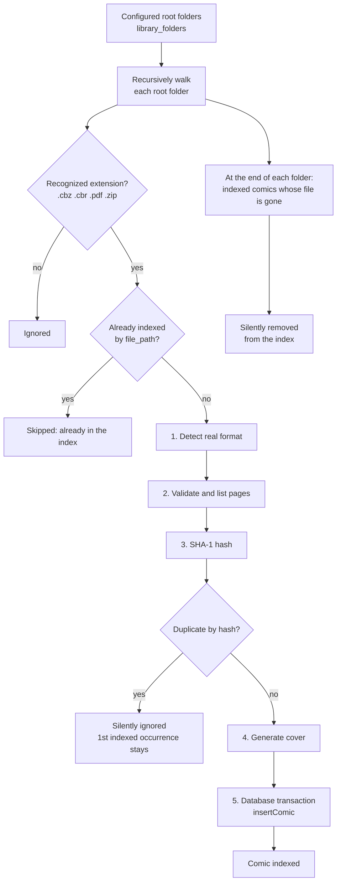

# 05 — Library folders (scan)

Covers RF-01 to RF-06 and RNF-05.

> **Note (docs/10-decisoes.md):** this document originally described an *import* pipeline — the user picked files one by one (or dropped them onto the window) and the app **copied** each one into an internal, managed folder (`library/`). That model was replaced: the user points to one or more folders where they already organize their comics, and the app scans them recursively and reads them **in place**, without copying anything. See the corresponding ADR in `docs/10-decisoes.md`.

## 1. Overview

The scan is performed by `LibraryScanService` (`src/main/services/library-scan-service.ts`), triggered (a) automatically on app boot, and (b) on demand via the "Refresh library" button in the sidebar or when adding a new folder. There is no real-time file watcher (v2) — the scan is always a one-off event, start to finish.

## 2. Walking the root folders (RF-02, RF-03)

`walkDirectory()` (`src/main/utils/walk-directory.ts`) is a recursive async generator:

1. Lists the folder's contents with `readdir(..., { withFileTypes: true })`.
2. Skips dotfiles/dot-folders and known junk names (`.git`, `__MACOSX`, `node_modules`).
3. Does not follow symbolic links to subfolders (avoids cycles).
4. For each file, filters by extension (lowercased): `.cbz`, `.cbr`, `.pdf`, `.zip` (`IMPORTABLE_EXTENSIONS`, `src/shared/constants.ts`). Any other extension is silently ignored — there is no "error summary" like in the old pipeline, because the scan runs on its own, with no user waiting on a dialog.
5. "It may be chained" (RF-02): recursion has no depth limit — subfolders inside subfolders are all walked.

Each root folder is a row in `library_folders` (docs/03 §2.1); `LibraryScanService.scan()` iterates over all of them.

## 3. A comic inside a `.zip` (RF-02)

Unlike the old pipeline (which also inspected ZIPs looking for *internal* comics, e.g., a `pack.zip` containing several `.cbz` files), the folder scan treats every `.zip` found as **a single candidate comic** — just like a `.cbz`. If the ZIP contains only images, it becomes a comic with those images as pages (same validation logic as step 2 below). A `.zip` that is actually a "pack" of several comics should be unpacked by the user in the folder (that is file organization, outside the app's scope — see `docs/10-decisoes.md`).

## 4. Processing a found file (`LibraryScanService.importFile`)

| # | Step | Details | Outcome on failure |
|---|---|---|---|
| 1 | **Detect format** | Reads the file's bytes (in place, without copying) and the signature: `PK\x03\x04` → zip, `Rar!\x1A\x07` → rar, `%PDF-` → pdf. The wrong extension is tolerated (e.g., a `.cbr` that is actually ZIP). | Unknown signature → file ignored, warning logged |
| 2 | **Validate and list pages** | zip/rar: `listPages()` → filters images (§5) and sorts with natural sort. Requires ≥ 1 page. pdf: `pdf-lib` → `getPageCount()` ≥ 1. | No pages/corrupted → ignored, warning logged |
| 3 | **Hash** | SHA-1 of the file's content. | — |
| 4 | **Duplicate** | `SELECT id, title FROM comics WHERE file_hash = ?` (the same comic reachable through two overlapping root folders, or a genuinely duplicate file). If it already exists, the file is ignored — no dialog: the scan is automatic and non-interactive (RF-05). | Ignored, warning logged |
| 5 | **Cover** | zip/rar: reads page 0 → `resizeToJpeg` → 400 px wide, JPEG q82 → `covers/comics/{id}.jpg`. pdf: placeholder (`cover_version = 0`) until PDF render support arrives (see the TODO in `cover-service.ts`). A cover failure **never** blocks indexing. | — (log only) |
| 6 | **Database** | In a transaction (`insertComic`): `INSERT comics` (with `file_path`, `dir_path`, `folder_id`), `INSERT comic_pages` (zip/rar), `INSERT reading_progress`. | File ignored, error logged |

Since there is no longer any "materialize into a tmp folder" or "move into `library/`" step (the comic is read directly from where it is), the pipeline became shorter — and more robust: each processed file only touches the database in the final step, in a single atomic transaction, so an app crash mid-scan never leaves a partial record (only comics not yet scanned, which the next scan picks up again).

## 5. Page rules

Unchanged from the previous pipeline:

- **Accepted image extensions:** `.jpg .jpeg .png .webp .gif .bmp .avif` (case-insensitive).
- **Ignored:** directory entries, `__MACOSX/`, files starting with `.` (e.g., `._001.jpg`), `Thumbs.db`, `desktop.ini`, `ComicInfo.xml` (reserved for v2), `.txt`, `.nfo`, `.xml`, `.url`.
- **Order:** natural sort over the entry's **full path** (`Intl.Collator('en', { numeric: true, sensitivity: 'base' })`, `src/main/archive/natural-sort.ts`), so that `folder1/10.jpg` comes after `folder1/2.jpg` and subfolders are respected.
- `page_index` is 0-based and contiguous after filtering.

## 6. "Next file in the folder" (RF-42)

The same natural-sort utility (`naturalSort()`) resolves "next comic" navigation at the end of reading: when a comic is opened, `ReaderService` fetches all comics with the same `dir_path` (docs/03 §2.2), sorts their `file_path` with `naturalSort()`, and returns the one that comes right after the current one (`null` if it is the last or the only one in the directory). This entirely replaces the old "next in saga" navigation — it does not depend on any manual organization by the user, only on the alphanumeric order of file names within the folder.

## 7. Files that disappear (RF-04)

At the end of each root folder, the scan compares the comics already indexed under it (`listComicsInFolder`) against the disk (`existsSync`). Those that no longer exist are removed from the index by the same deletion routine used by `LibraryService` (`delete(ids, { deleteFile: false })`), which also clears the cover and cache — it never tries to delete a file that is already gone. This covers both files that were truly deleted and ones moved/renamed outside the app: a new scan finds the file at the new path as a "new" comic (new id, progress reset — there is no way to know it is "the same" comic without looking at its content, and the hash alone is not enough to decide this automatically without risking reusing progress from the wrong comic).

## 8. Adding/removing root folders (RF-01, RF-03)

- **Add:** `libraryFolders.add()` opens `dialog.showOpenDialog({ properties: ['openDirectory'] })`. Upon confirmation, the folder is saved (`insertLibraryFolder`) and a scan runs before the IPC call resolves, so the UI can already list the new comics.
- **Remove:** `libraryFolders.remove(id)` deletes the row from `library_folders`; the database cascade removes the comics indexed under it (never the files, docs/03 §2.1).
- An already-configured folder (same path) → `CONFLICT`.

## 9. Limits and performance

- No file size limit. The exception is `node-unrar-js`, which needs the file in memory for RAR: very large RAR files cause higher memory usage during the scan — acceptable because the scan runs in the background, one file at a time.
- Scanning 5,000 files must not freeze the UI: `LibraryScanService` runs entirely in the main process, and each file is an isolated async operation (RNF-02).

## 10. Required test cases

See fixtures in [09](09-testes-e-qualidade.md#3-fixtures).

1. Valid CBZ in a root folder → 1 comic, pages in natural order, cover generated.
2. Valid CBR (RAR4 and RAR5) → 1 comic.
3. A `.cbr` that is actually ZIP → imported as zip.
4. Valid PDF → 1 comic with the correct `page_count`.
5. ZIP with only images → 1 comic.
6. Subfolder inside a subfolder (2+ levels) → files found and indexed.
7. Corrupted/truncated file → ignored, without interrupting the scan of the others.
8. Same file reachable through two root folders (or duplicate hash) → only the first occurrence is indexed.
9. File removed/renamed externally → disappears from the index on the next scan.
10. `.epub` extension → ignored.
11. Scan interrupted midway (process killed) → on reopening, the next automatic scan completes the work without duplicating already-indexed comics.
